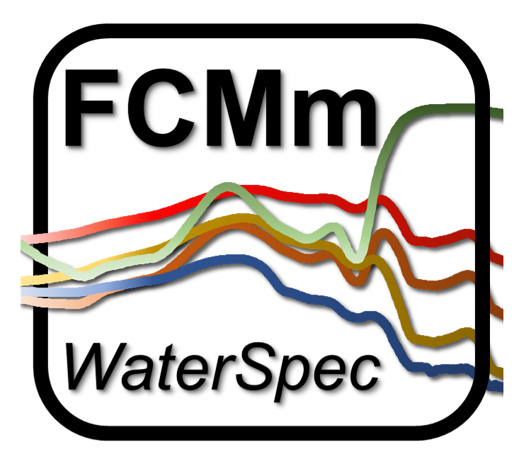

```{r setup, include=FALSE}
knitr::opts_chunk$set(
  collapse = TRUE,
  comment = "#>",
  fig.path = "man/figures/README-",
  out.width = "60%",
  fig.align = "center"
)
options(tibble.print_min=5, tibble.print_max=5)
```

# FCMm <a href='https://github.com/bishun945/FCMm'></a>

[](https://travis-ci.org/bishun945/FCMm)

**Author**: Shun Bi  
**Date**: `r Sys.Date()`  
**Version**: `r gsub("Version: ","",readLines('DESCRIPTION')[stringr::str_which(readLines('DESCRIPTION'), 'Version')])`  
**E-mail**: bishun1994@foxmail.com

## Overview

`FCMm` is a package for fuzzy clustering water spectra (or called water color). Given that the most of water color spectra data sets are considered as the high dimensional set, the advantage of this method is making FCM assign the membership (sum as 1) harder, ensuring the desired water type are restricted to its belongings (not too soft). It is possible to cluster the harm algal bloom water type which can not be produced by FCM with `m=2`.

  - If you want to cluster your own data sets, it provides an improved Fuzzy Cluster Method (FCM) by optimizing the fuzzifier value (default but not good being 2). 
  - You can also use the built-in cluster of inland waters produced by [Bi *et al.* (2019)][Bi] and can simply obtain the Chlorophyll-a concentration by blending three algorithms with relatively low bias.  
  - It supports raster (or called imagery) processing (see more details in help documents or vignettes).
  - It includes several data sets about water color spectra and corresponding water quality parameters and a testing image raster (see help documents for details).
  - Please see [NEWS](./NEWS.md) to get changes in each version.

## Installation

The GitHub version requires the package devtools

```{r, eval=FALSE}
install.packages("devtools") # install devtools require
devtools::install_github('bishun945/FCMm', build_vignettes=TRUE)
```

## Usage

```{r, message=FALSE, warning=FALSE}
# Load testing data
library(FCMm)
library(ggplot2)
data("WaterSpec35")
data("Bi_clusters")
Rrs <- WaterSpec35[,3:17]
# Plot the spectra
plot_spec_from_df(Rrs) + 
  labs(x='Wavelength (nm)',y=expression(Rrs~(sr^-1))) + 
  theme_bw() + 
  theme(legend.position='none', text=element_text(size=18))
# Applying FCMm
result <- apply_FCM_m(Rrs=Rrs, option.plot=TRUE)
plot(result$p.group)
# plot(result$p.group+facet_wrap(~cluster, ncol=2))
```

## Getting help

 - About this package, I have written four vignettes to present the usage of `FCMm`. Please read them carefully if you want to use this package for your research. Also, e-mail me via [bishun1994@foxmail.com][myemail] without hesitation if you have any questions or find any bug about it. They are:
    + [Cluster_number_determination](./doc/Cluster_number_determination.html)
    + [Fuzzy_cluster_training](./doc/Fuzzy_cluster_training.html)
    + [New_Data_Running_FCMm](./doc/New_Data_Running_FCMm.html)
    + [Raster_Running_FCMm](./doc/Raster_Running_FCMm.html)
 - If you are more interested in the application of FCM-m about inland water spectra, I recommend you to read [Bi *et al.* (2019)][Bi] for more details.
 - If you want to know some theoretical knowledge about FCM in mathematics, you could read some researches like [Dembele *et al.* (2018)][Dembele].
 - More about FCM in remote sensing applications, you can read [Moore *et al.* (2014)][Moore] and [Jackson *et al.* (2017)][Jackson] which focus on Case-II and Case-I waters, respectively.
 - See more details about optical water types of inland waters in [Spyrakos *et al.* (2018)][Spyrakos]
 - Hope you will enjoy using this package and have a nice day.

[Bi]: https://www.osapublishing.org/oe/abstract.cfm?uri=oe-27-24-34838
[Dembele]: https://link.springer.com/article/10.1007/s11634-008-0032-5
[Moore]: https://www.sciencedirect.com/science/article/pii/S0034425713004434
[Jackson]: https://www.sciencedirect.com/science/article/pii/S0034425717301396
[Spyrakos]: https://aslopubs.onlinelibrary.wiley.com/doi/abs/10.1002/lno.10674
[myemail]: bishun1994@foxmail.com
