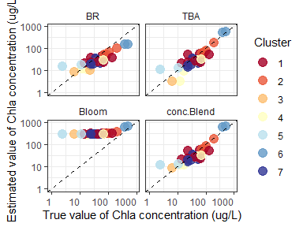
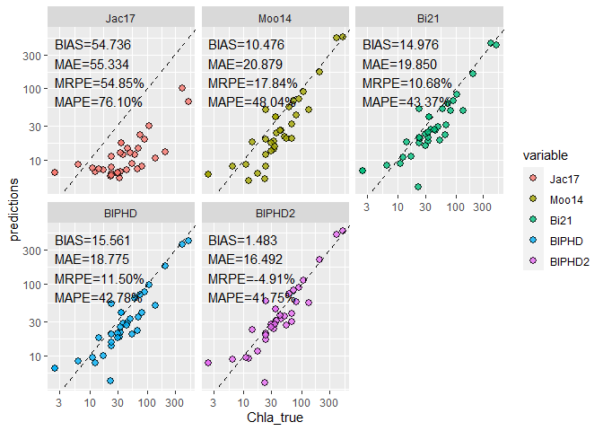

# FCMm <a href='https://github.com/bishun945/FCMm'></a>

<!-- badges: start -->

[](https://CRAN.R-project.org/package=FCMm)
[](https://lifecycle.r-lib.org/articles/stages.html#stable)
[](https://mybinder.org/v2/gh/bishun945/FCMm/master)
[](https://github.com/bishun945/FCMm/actions)
<!-- [](https://codecov.io/gh/bishun945/FCMm?branch=master) -->

<!-- badges: end -->

**Author**: Shun Bi  
**Date**: 2021-03-13  
**Version**: 0.11.1  
**E-mail**: <bishun1994@foxmail.com>

## Overview

`FCMm` is a package for fuzzy clustering water spectra (or called water
color). Given that the most of water color spectra data sets are
considered as the high dimensional set, the advantage of this method is
making FCM assign the membership (sum as 1) harder, ensuring the desired
water type are restricted to its belongings (not too soft). It is
possible to cluster the harm algal bloom water type which can not be
produced by FCM with `m=2`.

-   If you want to cluster your own data sets, it provides an improved
    Fuzzy Cluster Method (FCM) by optimizing the fuzzifier value
    (default but not good being 2).
-   You can also use the built-in cluster of inland waters produced by
    [Bi *et
    al.* (2019)](https://www.osapublishing.org/oe/abstract.cfm?uri=oe-27-24-34838)
    and can simply obtain the Chlorophyll-a concentration by blending
    three algorithms with relatively low bias.  
-   It supports raster (or called imagery) processing (see more details
    in help documents or vignettes).
-   It includes several data sets about water color spectra and
    corresponding water quality parameters and a testing image raster
    (see help documents for details).
-   Please see [NEWS](./NEWS.md) to get changes in each version.

## Installation

The GitHub version requires the package devtools

``` r
# install it from GitHub quickly by `devtools` package
devtools::install_github('bishun945/FCMm')

# or use `remotes` package
remotes::install_github('bishun945/FCMm')

# install it and build vignettes 
devtools::install_github('bishun945/FCMm', build_vignettes=TRUE)
```

## Usage

### 1. Classification of water spectra based on pre-defined cluster centers

This chunk introduces the usage of applying the `FCMm` package (and its
built-in centrodis) to cluster water spectra. The details of obtaining
the centrodis could be found in [Bi *et al.*
(2019)](https://www.osapublishing.org/oe/abstract.cfm?uri=oe-27-24-34838).
Also, run `vignette("Builtin_centrodis")` to see more about this
application.

``` r
# Load testing data
library(FCMm)
library(ggplot2)
data("WaterSpec35")
data("Bi_clusters")
Rrs <- WaterSpec35[,3:17]
# Plot the spectra
plot_spec_from_df(Rrs) + 
  labs(x='Wavelength (nm)',y=expression(Rrs~(sr^-1))) + 
  theme_bw() + 
  theme(legend.position='none', text=element_text(size=13))
```


``` r
# Applying FCMm
result <- apply_FCM_m(Rrs=Rrs, option.plot=TRUE, do.stand=TRUE)
plot(result$p.group + theme(text=element_text(size=13)))
```


``` r
# plot(result$p.group+facet_wrap(~cluster, ncol=2))
```

### 2. Algorithms blending via membership values from FCMm (version of Bi et al., 2019)

``` r
library(magrittr)
dt_Chla <- FCM_m_Chla_estimation(Rrs=data.frame(Rrs665=Rrs$`665`,
                                                Rrs709=Rrs$`708.75`,
                                                Rrs754=Rrs$`753.75`),
                                 U=result$u)
dt_Chla$cluster <- result$cluster %>% as.character
dt_Chla$Chla_true <- WaterSpec35$Chla

# oldoptions <- options(scipen=1000)

subset(dt_Chla, select=c('cluster','Chla_true','BR','TBA','Bloom','conc.Blend')) %>%
  reshape2::melt(., id=c('cluster','Chla_true')) %>%
  ggplot(data=.) + 
  geom_point(aes(x=Chla_true,y=value,group=cluster,color=cluster),
             alpha=0.8, size=4) +
  scale_x_log10(limits=c(1,900)) + 
  scale_y_log10(limits=c(1,900)) +
  scale_color_manual(values=RdYlBu(result$K)) + 
  labs(x='True value of Chla concentration (ug/L)',
       y='Estimated value of Chla concentration (ug/L)',
       color='Cluster') + 
  geom_abline(intercept=0, slope=1, linetype=2) + 
  facet_wrap(~variable, nrow=2) + 
  theme_bw() + 
  theme(axis.text.x.bottom = element_text(hjust=1),
        strip.background = element_blank())
```



``` r
# on.exit(options(oldoptions))
```

### 3. Assessment of Chla concentration algorithms

`FCMm` provides an useful function to assess the performance of
algorithms, i.e., `Assessment_via_cluster()`. Users can decide to select
the `FCMm`-supported error measures (metrics) by themselves (run
`cal.metrics.names()` or `cal.metrics.vector.names()` to see what
metrics could be used). A more detailed vignette is given to introduce
the usage of the assessment work (run `vignette("Assessment")` to see
more).

``` r
pred = dt_Chla[,c("BR","TBA","Bloom","conc.Blend")] %>% 
  setNames(., c("BR","TBA","Bloom","Blend"))
meas = dt_Chla[,"Chla_true"]
memb = dt_Chla[,paste0("M.", 1:7)] %>% 
  setNames(., 1:7)
Assess_soft <- Assessment_via_cluster(pred = pred,
                                      meas = meas,
                                      memb = memb,
                                      metrics = c("MAE", "MAPE"),
                                      log10 = TRUE,
                                      total = TRUE,
                                      hard.mode = FALSE,
                                      cal.precision = FALSE,
                                      na.process = TRUE,
                                      plot.col = TRUE)
Assess_soft$res_plot_facet
```


``` r
knitr::kable(Assess_soft$MAE %>% round(3))
```

|     |    BR |   TBA | Bloom | Blend |
|:----|------:|------:|------:|------:|
| 1   | 0.254 | 0.230 | 0.880 | 0.229 |
| 2   | 0.214 | 0.102 | 0.532 | 0.106 |
| 3   | 0.243 | 0.285 | 1.314 | 0.130 |
| 4   | 0.197 | 0.259 | 0.930 | 0.196 |
| 5   | 0.530 | 0.419 | 1.638 | 0.426 |
| 6   | 0.464 | 0.080 | 0.162 | 0.148 |
| 7   | 0.168 | 0.208 | 0.987 | 0.162 |
| SUM | 0.254 | 0.225 | 0.928 | 0.200 |

``` r
knitr::kable(Assess_soft$MAPE %>% round(2))
```

|     |     BR |   TBA |  Bloom | Blend |
|:----|-------:|------:|-------:|------:|
| 1   |  16.64 | 15.45 |  64.46 | 15.32 |
| 2   |  10.64 |  5.40 |  28.65 |  5.54 |
| 3   |  20.24 | 32.92 | 131.42 | 14.26 |
| 4   |  12.57 | 18.34 |  66.03 | 12.53 |
| 5   | 114.32 | 92.40 | 323.21 | 94.13 |
| 6   |  17.42 |  3.01 |   6.10 |  5.57 |
| 7   |  13.83 | 16.76 |  75.27 | 13.08 |
| SUM |  23.96 | 22.39 |  88.10 | 20.03 |

### 4. Algorithms blending frameworks (updated in Feb 22, 2021)

``` r
data(WaterSpec35)
res_Jac17 = Blend_Jac17(WaterSpec35[, -c(1, 2)])
res_Moo14 = Blend_Moo14(WaterSpec35[, -c(1, 2)])
res_Bi21  = Blend_Bi21(WaterSpec35[, -c(1, 2)])
res_BiPHD = Blend_FCMm(WaterSpec35[, -c(1, 2)])

dt_compare <- data.frame(
  Chla_true = WaterSpec35$Chla,
  Jac17  = res_Jac17$Chla_blend,
  Moo14  = res_Moo14$Chla_blend,
  Bi21   = res_Bi21$Chla_blend,
  BIPHD  = res_BiPHD$Chla_blend,
  BIPHD2 = res_BiPHD$Chla_reparam
) %>% reshape2::melt(., id = "Chla_true")

er_agg <- function(x) {
  stats::aggregate(x, list(dt_compare$variable), mean)[, 2]
}
dt_compare$er1 <- dt_compare$Chla_true - dt_compare$value
dt_compare$er2 <- (dt_compare$Chla_true - dt_compare$value) / dt_compare$Chla_true * 100

er_df <- data.frame(
  BIAS = er_agg(dt_compare$er1),
  MAE  = er_agg(abs(dt_compare$er1)),
  MRPE = er_agg(dt_compare$er2),
  MAPE = er_agg(abs(dt_compare$er2))
) %>% cbind(variable = levels(dt_compare$variable), .)
er_df$label <- sprintf("BIAS=%.3f\nMAE=%.3f\nMRPE=%.2f%%\nMAPE=%.2f%%", 
                       er_df$BIAS, er_df$MAE, er_df$MRPE, er_df$MAPE)

ggplot(dt_compare) + 
  geom_point(aes(x = Chla_true, y = value, fill = variable),
             size = 2.5, alpha = 0.8, color = "black", 
             shape = "circle filled") +
  geom_abline(slope = 1, intercept = 0, linetype = 2) + 
  geom_text(inherit.aes = FALSE, data = er_df,
            aes(x = min(dt_compare$Chla_true), y=max(dt_compare$Chla_true),
                label = label), vjust = 1, hjust = 0) + 
  facet_wrap(~variable) + 
  labs(y="predictions") + 
  scale_x_log10() + 
  scale_y_log10()
```



## Getting help

-   About this package, I have written several vignettes to present the
    usage of `FCMm`. Please read them carefully if you want to use this
    package for your research. Also, e-mail me via
    `bishun1994@foxmail.com` without hesitation if you have any
    questions or find any bug about it.
-   If you are more interested in the application of FCM-m about inland
    water spectra, I recommend you to read [Bi *et
    al.* (2019)](https://www.osapublishing.org/oe/abstract.cfm?uri=oe-27-24-34838)
    for more details.
-   If you want to know some theoretical knowledge about FCM in
    mathematics, you could read some researches like [Dembele *et
    al.* (2018)](https://link.springer.com/article/10.1007/s11634-008-0032-5).
-   More about FCM in remote sensing applications, you can read [Moore
    *et
    al.* (2014)](https://www.sciencedirect.com/science/article/pii/S0034425713004434)
    and [Jackson *et
    al.* (2017)](https://www.sciencedirect.com/science/article/pii/S0034425717301396)
    which focus on Case-II and Case-I waters, respectively.
-   See more details about optical water types of inland waters in
    [Spyrakos *et
    al.* (2018)](https://aslopubs.onlinelibrary.wiley.com/doi/abs/10.1002/lno.10674)
-   Hope you will enjoy using this package and have a nice day.

## References

-   Bi S, Li Y, Xu J, et al. Optical classification of inland waters
    based on an improved Fuzzy C-Means method\[J\]. Optics Express,
    2019, 27(24): 34838-34856.
-   Jackson T, Sathyendranath S, Mélin F. An improved optical
    classification scheme for the Ocean Colour Essential Climate
    Variable and its applications\[J\]. Remote Sensing of Environment,
    2017, 203: 152-161.
-   Moore T S, Dowell M D, Bradt S, et al. An optical water type
    framework for selecting and blending retrievals from bio-optical
    algorithms in lakes and coastal waters\[J\]. Remote sensing of
    environment, 2014, 143: 97-111.
-   Spyrakos E, O’Donnell R, Hunter P D, et al. Optical types of inland
    and coastal waters\[J\]. Limnology and Oceanography, 2018, 63(2):
    846-870.
-   Dembele D. Multi-objective optimization for clustering 3-way gene
    expression data\[J\]. Advances in Data Analysis and Classification,
    2008, 2(3): 211-225.
